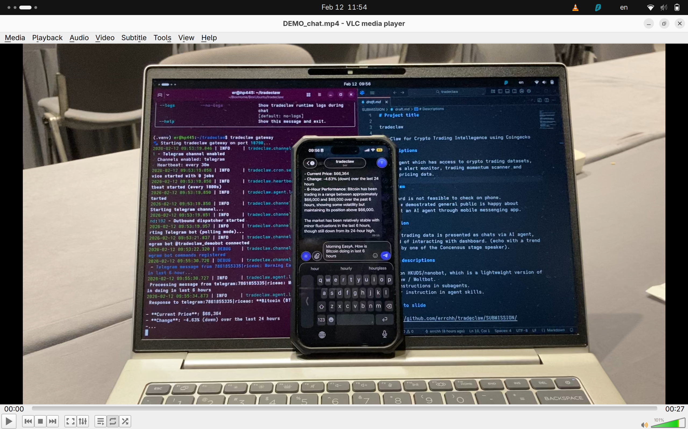

# tradeclaw

A crypto trading intellegence AI agent based-on HKUDS/nanobot inspired by OpenClaw. 

# Demo




<video src="DEMO_background.mp4" controls width="600"></video>

<video src="DEMO_chat.mp4" controls width="600"></video>

## Quick Start

```bash
cd tradeclaw
uv run python -m tradeclaw

OR

pip install tradeclaw
tradeclaw onboard                    # Initialize config
# Add API key to ~/.tradeclaw/config.json
tradeclaw agent -m "Identify momentum in last 6 hours."     # Single query
tradeclaw agent                      # Interactive mode
```

## Features

OpenClaw for Crypto Trading Intellegence using Coingecko.

#### Descriptions

An AI agent which has access to crypto trading datasets, provides alert monitor, trading momentum scanner and answer pricing data. 

#### Problem

Dashboard is not feasible to check on phone. 

OpenClaw demostrated general public is happy about interact an AI agent through mobile messenging app.

#### Solution

Crypto trading data is presented as chats via AI agent, instead of interacting with dashboard. (echo with a trend talked by one of the Concensus stage speaker).

#### Tech descriptions

Based on HKUDS/nanobot, which is a lightweight version of OpenClaw / Moltbot. 

Wrapped functionalities in subagents, 
Further instructions in agent skills.

## Configuration

```json
{
  "providers": {
    "openrouter": {
      "apiKey": "sk-or-..."
    }
  },
  "channels": {
    "telegram": {
      "enabled": true,
      "token": "..."
    }
  }
}
```

## Structure

```
tradeclaw/
├── agent/          # Core loop, context, memory, tools
├── channels/       # Messaging platform integrations  
├── providers/      # LLM provider registry
├── skills/         # Domain-specific capabilities
├── bus/            # Async message queue
└── cron/           # Scheduled task service
```

MIT License
